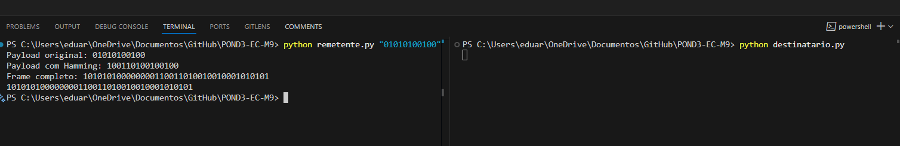

# Protocolo de Comunicação com Código de Hamming

Este projeto implementa um sistema de comunicação entre um remetente e um destinatário, utilizando o código de Hamming para correção de erros.

## Protocolo

O frame é composto pelos seguintes elementos:
1. **Cabeçalho (Header)**: 8 bits (0xAA) - usado para sincronização
2. **Tamanho do Payload**: 8 bits - indica o tamanho do payload em bytes
3. **Payload**: sequência de bits de dados
4. **Código de Hamming**: bits de paridade adicionados ao payload
5. **Terminador (Footer)**: 8 bits (0x55) - marca o fim do frame

## Como Usar

1. Execute o remetente com uma sequência de bits:
```bash
python remetente.py "01101001" | python destinatario.py
```

## Funcionamento

### Remetente
1. Recebe uma sequência de bits como entrada
2. Adiciona o código de Hamming para correção de erros
3. Cria o frame com cabeçalho, tamanho, payload e terminador
4. Envia o frame através do stdout

### Destinatário
1. Recebe o frame através do stdin
2. Sincroniza a leitura usando o cabeçalho e terminador
3. Verifica e corrige erros usando o código de Hamming
4. Exibe a mensagem decodificada


## Correção de Erros

O sistema utiliza o código de Hamming para detectar e corrigir erros de 1 bit no payload. O código de Hamming adiciona bits de paridade em posições específicas para permitir a detecção e correção de erros. 